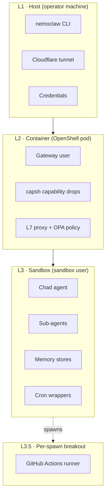
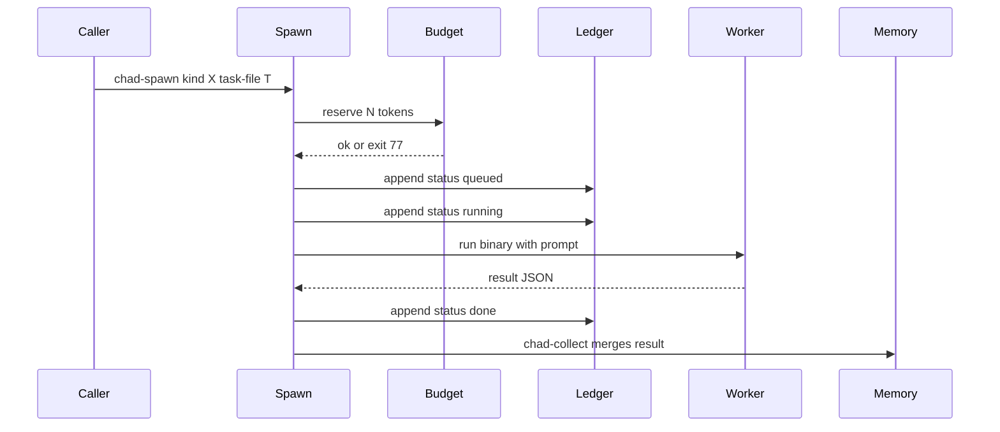
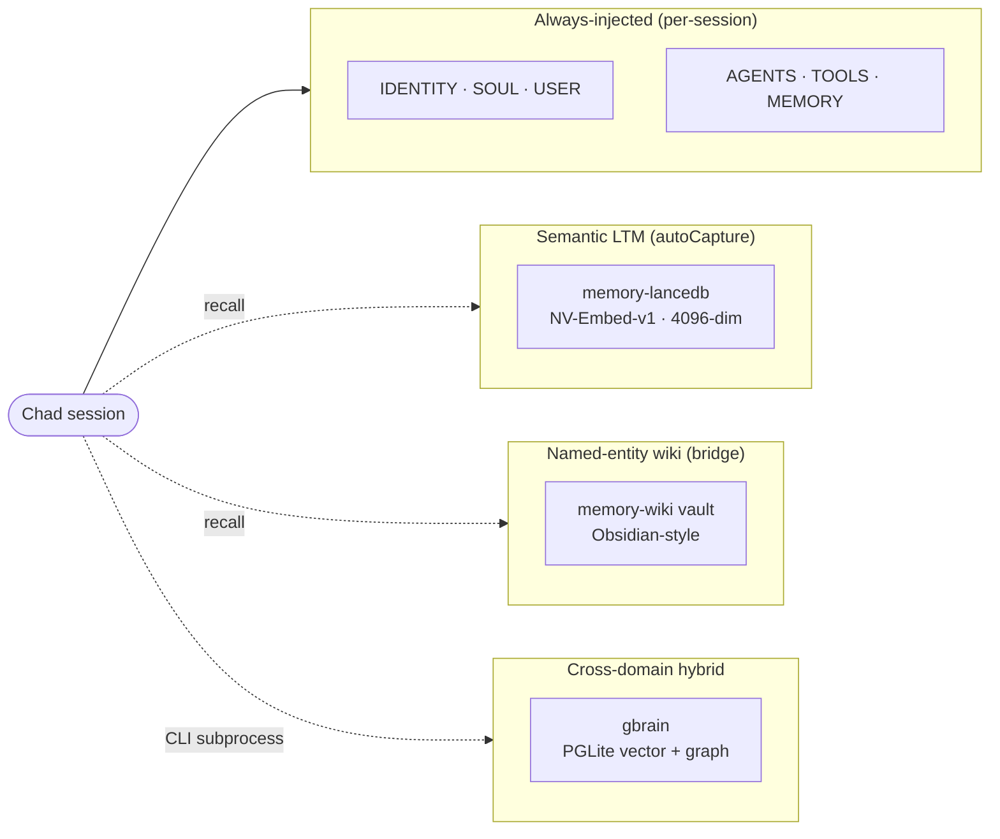
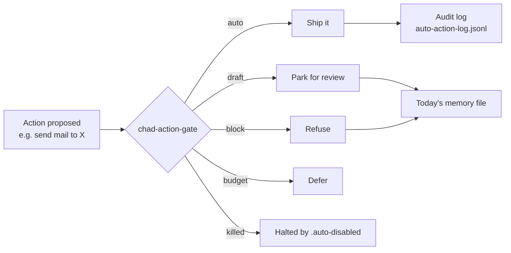

# Architecture

Chad is a small amount of glue across a stack of things that already
work. The interesting design is in the boundaries: where Chad's process
ends and OpenShell's gateway begins; where a sub-agent's filesystem
ends and the GitHub Actions runner's begins; where the autonomy
boundary sits relative to each external action.

## The three concentric rings

A naked CLI agent has no blast-radius story. Chad runs inside three
boundaries, each with a different threat model:

| Ring | What lives here | What enforces the boundary |
|---|---|---|
| **L1 · Host** | nemoclaw CLI, credentials, Cloudflare tunnel | OS user, file permissions, SSH keys |
| **L2 · Container** | OpenShell gateway user, L7 proxy, OPA policy engine | Linux capabilities (capsh drops), policy hash check at boot |
| **L3 · Sandbox** | Chad, pi, claude, gh, curl, gbrain, sub-agents | Per-binary L7 egress allowlists pinned by `/proc/self/exe` |
| **L3.5 · GHA runner** | One-off sub-agent spawns under `substrate: gha` | Fresh VM per workflow run, no shared state with Chad |

Three of the rings (L1, L2, L3) are kernel/OS-enforced. The L7
allowlists at the sandbox layer are policy-enforced — same syscall
vocabulary, but the squid+OPA combination decides whether each egress
flow is in-policy.

The fourth boundary (L3.5) is a per-spawn substrate choice, not
an always-on ring. See [Substrates](substrates.md).

!!! warning "L3.5 loses L7 enforcement"
    The GHA breakout swaps *kernel-isolation* for *policy-isolation*.
    A spawn under `substrate: gha` runs in a fresh GitHub Actions VM
    — strong isolation from Chad's container — but the L7 proxy +
    OPA stack does not exist on the runner side. Per-binary egress
    allowlists that hold inside L3 do **not** hold on the runner.
    Pick `gha` for self-contained jobs (codex writing a markdown
    report, opencode hitting a public API). Pick `local` for jobs
    that need L7 enforcement (anything writing back to `chad-state`,
    anything touching premium credentials).

## The spawn flow

A typical chad-spawn invocation walks through this:

The conditional split between the two substrates:

- **`local`** — `Spawn` runs the binary in-container under timeout, captures stdout, parses the last line as JSON.
- **`gha`** — `Spawn` pushes a `chad-spawn/<id>` branch with the rendered prompt and dispatches an `agent-job.yml` workflow. With `--async`, it returns the task id immediately; the `chad-spawn-poll` cron reconciles when the runner commits `result.json` back. With `--sync`, it polls until the branch updates.

Self-messages (`Spawn->>Spawn`) like *render prompt from manifest* and *push spawn branch* happen between the steps above; they're elided here so the swimlanes stay readable.

Participants in plain English:

- **Caller** — Chad, a cron wrapper, or a chat turn.
- **Spawn** — `chad-spawn`, the orchestrator entry point.
- **Budget** — `chad-budget`, daily token reservation.
- **Ledger** — `queue/tasks.jsonl`, append-only task record.
- **Sub** — the sub-agent binary (kind-dependent).
- **Memory** — today's `workspace/memory/<date>.md` file.

## The seven sub-agent kinds

Each kind is a YAML manifest pinning a binary, a network policy
preset, a default substrate, and a prompt template.

| Kind | Binary | Substrate | What it's for |
|---|---|---|---|
| `coder` | `pi` | local | Write/refactor code with build + tests |
| `researcher` | `claude` | local | Brain-first lookups; gh search if brain insufficient |
| `writer` | `claude` | local | Draft mail/docs; never publishes |
| `reviewer` | `claude` | local | Audit a PR diff; GET-only on GitHub |
| `fitness` | `claude` | local | Strength + mobility from gbrain-ingested books |
| `codex` | `codex` (npm) | gha | OpenAI Codex; NVIDIA fallback when no `OPENAI_API_KEY` |
| `opencode` | `opencode` (npm) | gha | Multi-provider; honors `OPENAI_BASE_URL` |

Adding a new kind is four files (manifest, policy preset, optionally a
runner install step, sync) — no recompile, no image rebuild. Details
in [Orchestrator](orchestrator.md).

## The four memory layers

What goes where:

- **Identity / principles / autonomy policy** → workspace files. Loaded
  into every main session. Operator-owned, not curated by Chad.
- **"Remember this preference / decision / contact"** → memory-lancedb.
  Captures fire automatically on multilingual triggers
  (remember/preferences/decisions/possessives).
- **Per-system reference / per-correspondent rich page** → memory-wiki
  vault. Look up by name. Backlinks form a graph.
- **Cross-domain knowledge / book chunks / research** → gbrain. Two
  books fully ingested for the `fitness` kind today.

The full decision tree is in [Memory stack](memory.md).

## The autonomy boundary

Every external action passes through the action gate:

The gate's policy is `/sandbox/.openclaw-data/auto-actions.json`. It's
intended to be **readable** — the autonomy roadmap is the diff between
"what's `auto` today" and "what's `draft` or `block` today." See
[Autonomy](autonomy.md).

## Two execution substrates

Sub-agent spawns route to one of two backends:

| Substrate | Runs in | Isolation | Network policy | Async |
|---|---|---|---|---|
| `local` | Chad's container | Process tree shared with parent | L7 policy preset enforced | No (sync only) |
| `gha` | Fresh GitHub Actions runner | Per-spawn VM | Lost — runner has wide egress | Yes (`--async`) |

The `local` substrate is right when the sub-agent needs gbrain, the
sandbox source clone, or NVIDIA inference. The `gha` substrate is
right when the sub-agent is self-contained — codex writing a markdown
report from a prompt, opencode running against an external repo.

A future `pod` substrate (Phase D in the design doc) would give the
isolation of GHA runners with the L7 policy enforcement of the local
substrate. Not built yet.

## Where the source lives

- **NemoClaw** (NVIDIA-owned blueprint) — [tantodefi/NemoClaw](https://github.com/tantodefi/NemoClaw)
  on the `chad-dev` branch. The hardened sandbox image, the policy
  presets, the orchestrator scripts, the cron wrappers.
- **gbrain** — [tantodefi/gbrain](https://github.com/tantodefi/gbrain).
  PGLite-backed knowledge brain.
- **chad-state** (private) — `tantodefi/chad-state`. Backup of the
  workspace dir + the agent-job workflow for the GHA substrate. Not
  publicly readable; no link.
- **OpenClaw** — [openclaw.ai](https://openclaw.ai). The agent
  runtime Chad runs as.
- **OpenShell** — [NVIDIA/OpenShell](https://github.com/NVIDIA/OpenShell).
  The sandbox + L7 gateway.
