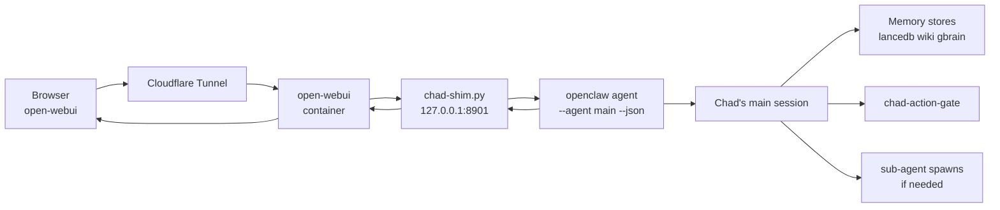

# Front-ends: Open WebUI

!!! info "Two front-ends"
    This page covers the **chat** surface (Open WebUI). The **workflow**
    surface — a web IDE for durable Smithers runs at
    `runs.supachad.com` — is documented at [Runs IDE](runs-ide.md).

Chad ships with one chat front-end out of the box: a self-hosted
[Open WebUI](https://openwebui.com) instance reached through a
Cloudflare Tunnel, with Chad himself exposed as a model named `chad`.
Every conversation goes through the same gateway, the same network
policies, the same memory stores, and the same action gate as a cron
or sub-agent invocation — Chad has one brain, multiple surfaces.

## What ships

| Path | Purpose |
|---|---|
| `scripts/openwebui/docker-compose.yml` | Open WebUI + reverse-proxy stack. Two modes — `quick` (ephemeral `*.trycloudflare.com`) and `tunnel` (managed CF Tunnel + CF Access SSO). |
| `scripts/openwebui/chad-shim.py` | Stdlib-only HTTP shim. Listens on `127.0.0.1:8901` inside the sandbox. Speaks OpenAI's `/v1/chat/completions` API. |
| `npm run webui:up` | One-shot launcher. Starts the docker-compose stack, opens the tunnel, prints the URL. |
| `npm run webui:chad:up` | Forwards `chad-shim.py` from the sandbox to the host so Open WebUI can reach it. |
| `npm run webui:chad:install` | Persistent `launchd` LaunchAgent for the shim port-forward, with `KeepAlive=true`. |

## How a chat turn flows



The shim is dumb on purpose — it's HTTP in, JSON out, one
`openclaw agent` invocation per turn. All the real work happens in
Chad's main session, which means:

- Each reply benefits from gbrain context (fitness sub-agents can
  answer from ingested books).
- Every external action goes through `chad-action-gate` — a chat
  user can't bypass autonomy by asking nicely.
- The action log records the turn the same way it records a cron.

## Two deploy modes

**`--mode=quick`** is the MVP. Spins up Open WebUI behind an
ephemeral `*.trycloudflare.com` URL. Email + password auth.
Disposable. Fastest path from "I want to try Chad in a browser" to a
working URL.

**`--mode=tunnel`** is the durable form. Requires:

- A Cloudflare account with a domain.
- A managed CF Tunnel (created via dashboard or
  `cloudflared tunnel create`).
- A CF Access policy in front of the hostname — header-trusted SSO,
  no Open WebUI password.

The trade-off is straightforward: tunnel mode is the version you'd
deploy if Chad were chatting with someone other than the operator.

## The shim's session model

`chad-shim.py` does not maintain its own conversation state. Each
incoming `/v1/chat/completions` request is mapped to an openclaw
`--session-id`, then dispatched as `openclaw agent --json --agent
main --session-id <id>`. The session is Chad's main session — the
same one a cron uses, the same one the dashboard uses, the same one
the operator uses over SSH.

**Session-id mapping (chad-shim/0.2+, 2026-05-13):** if Open WebUI
forwards `X-OpenWebUI-Chat-Id` (it does when `ENABLE_FORWARD_USER_INFO_HEADERS=True`),
the shim uses that chat-id directly — one openclaw session per Open
WebUI chat. Falls back to a stable hash of the first-message tuple
for direct API callers without the header.

**Per-operator routing (chad-shim/0.2+):** when the request carries
`X-OpenWebUI-User-Email`, the shim:

1. Slug-sanitizes the email local-part (e.g. `tantodefi@proton.me` →
   `tantodefi`)
2. Loads `/sandbox/.openclaw-data/identities/<slug>.md` (mtime-cached
   so edits land without a shim restart)
3. Prepends the file as a tagged operator-context block to the user
   message before dispatching to the openclaw agent

Unknown senders fall back to `default.md`. Anonymous (no headers)
gets no prefix. The result is that a single Open WebUI install can
serve multiple operators (e.g. `tantodefi` + `tjcooke`) with
distinct personas while sharing Chad's substrate.

For higher-trust mutations (calendar, notes, automations on the
operator's own OpenWebUI surfaces), the `chad-webui` CLI + matching
`webui__*` MCP tools enforce **per-operator API keys** with
fail-closed scoping: when `CHAD_OPERATOR_SLUG` is set, the wrapper
selects `OPENWEBUI_API_KEY_<SLUG>` and refuses to fall back to the
default admin key. Cross-operator writes hit HTTP 403 at the
OpenWebUI permission layer regardless of what the prompt says.

Consequences:

- **Per-operator history is preserved by chat-id.** Multiple users
  on the same Open WebUI install each get their own openclaw session
  — one per chat thread — but all running against Chad's main agent
  + memory + tools.
- **Operator personas via filesystem.** Edit
  `/sandbox/.openclaw-data/identities/<slug>.md` to tune what each
  operator sees from Chad. No service restart required.
- **Memory persists across surfaces.** A fact captured in a chat
  turn surfaces in the next email-check; a preference dropped via
  email shows up in the next chat reply.
- **The shim is stateless and supervised.** A `dev.nemoclaw.chad-shim-watchdog`
  launchd job (2026-05-14) probes `/v1/models` every 5 min and
  restarts the shim on death. Recoveries land in the agent-inbox
  for Chad's next cron turn to consume.

## Programmatic control plane — `chad-webui` and `webui__*` MCP tools

Beyond chat, Chad has a full programmatic surface to Open WebUI:

- **`chad-webui` CLI** (60 sub-commands across 10 groups —
  calendar / notes / automations / memories / chats / knowledge /
  models / functions / tools / folders). Covers the entire v0.9.5
  REST API. Source: `scripts/openwebui/chad-webui`.
- **`chad-webui-mcp`** registers each sub-command as a native MCP
  tool (`webui__<group>_<command>`) so the agent sees JSON schemas
  in its tool list rather than parsing shell exec output.
- **`openwebui` skill** documents every command with worked
  examples, composed recipes (save chat as note, reschedule
  events, knowledge ingestion), error-routing tables, and the
  network plumbing.

This is what lets Chad book a meeting, save a note, install a
custom function, or curate a RAG collection on operator request
— and what lets the nightly experiment loop materialize automations
as actual OpenWebUI artifacts.

## Persistence

`docker-compose.yml` mounts a named volume for Open WebUI's
SQLite database — chat history, user accounts, model preferences.
The volume is **not** part of `chad-backup-to-github` because the
authoritative record of every reply is already in `memory/<UTC>.md`
(via the action log). Losing the WebUI volume loses the *display* of
past conversations, not the conversations themselves.

The shim itself is stateless and reads its config from environment
variables — there's nothing to persist.

## Why a shim instead of a "Chad-native" UI

Two reasons:

1. **OpenAI-compat is the largest UI surface in the world.** Anything
   that can talk `/v1/chat/completions` (Open WebUI, LibreChat,
   custom React apps, mobile clients) gets Chad for free.
2. **The shim is ~200 lines of stdlib Python.** A Chad-native UI
   would be thousands of lines of frontend code with its own bugs,
   its own auth model, its own deployment surface. The shim
   delegates all of that to Open WebUI.

If you want a different UI, point it at the shim — Chad doesn't
care what's on the other side as long as the request shape is
OpenAI-compatible.

## Setup, briefly

```bash
# From the host
cd scripts/openwebui
./bring-up.sh --mode=quick

# Then on the host (forwards the shim from the sandbox)
npm run webui:chad:up

# Or, persistent launchd agent
npm run webui:chad:install
```

The full setup walkthrough lives at
[`docs/operations/openwebui.md`](https://github.com/tantodefi/NemoClaw/blob/chad-dev/docs/operations/openwebui.md)
in the source repo. This page is the architectural overview; that
one is the runbook.
