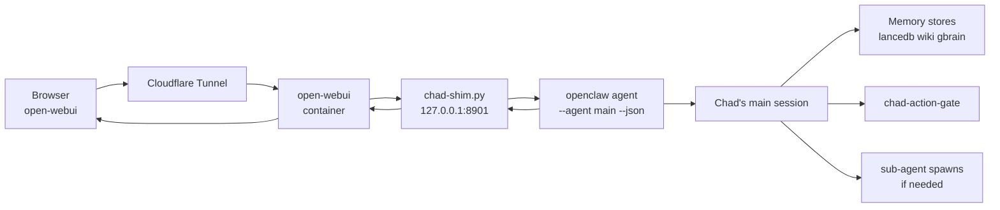

# Front-ends: Open WebUI

Chad ships with one chat front-end out of the box: a self-hosted
[Open WebUI](https://openwebui.com) instance reached through a
Cloudflare Tunnel, with Chad himself exposed as a model named `chad`.
Every conversation goes through the same gateway, the same network
policies, the same memory stores, and the same action gate as a cron
or sub-agent invocation — Chad has one brain, multiple surfaces.

## What ships

| Path | Purpose |
|---|---|
| `scripts/openwebui/docker-compose.yml` | Open WebUI + reverse-proxy stack. Two modes — `quick` (ephemeral `*.trycloudflare.com`) and `tunnel` (managed CF Tunnel + CF Access SSO). |
| `scripts/openwebui/chad-shim.py` | Stdlib-only HTTP shim. Listens on `127.0.0.1:8901` inside the sandbox. Speaks OpenAI's `/v1/chat/completions` API. |
| `npm run webui:up` | One-shot launcher. Starts the docker-compose stack, opens the tunnel, prints the URL. |
| `npm run webui:chad:up` | Forwards `chad-shim.py` from the sandbox to the host so Open WebUI can reach it. |
| `npm run webui:chad:install` | Persistent `launchd` LaunchAgent for the shim port-forward, with `KeepAlive=true`. |

## How a chat turn flows



The shim is dumb on purpose — it's HTTP in, JSON out, one
`openclaw agent` invocation per turn. All the real work happens in
Chad's main session, which means:

- Each reply benefits from gbrain context (fitness sub-agents can
  answer from ingested books).
- Every external action goes through `chad-action-gate` — a chat
  user can't bypass autonomy by asking nicely.
- The action log records the turn the same way it records a cron.

## Two deploy modes

**`--mode=quick`** is the MVP. Spins up Open WebUI behind an
ephemeral `*.trycloudflare.com` URL. Email + password auth.
Disposable. Fastest path from "I want to try Chad in a browser" to a
working URL.

**`--mode=tunnel`** is the durable form. Requires:

- A Cloudflare account with a domain.
- A managed CF Tunnel (created via dashboard or
  `cloudflared tunnel create`).
- A CF Access policy in front of the hostname — header-trusted SSO,
  no Open WebUI password.

The trade-off is straightforward: tunnel mode is the version you'd
deploy if Chad were chatting with someone other than the operator.

## The shim's session model

`chad-shim.py` does not maintain its own conversation state. Each
incoming `/v1/chat/completions` request is hashed
(`sha256(messages[-N:])`) into a stable `--session-id`, then passed
to `openclaw agent --json --agent main --session-id <hash>`. The
session is Chad's main session — the same one a cron uses, the same
one the dashboard uses, the same one the operator uses over SSH.

Consequences:

- **No per-user history split.** This is a single-operator design
  today. Multiple users on the same Open WebUI install would all
  share Chad's main session. (See [Roadmap](roadmap.md) for
  multi-Chad scheduling.)
- **Memory persists across surfaces.** A fact captured in a chat
  turn surfaces in the next email-check; a preference dropped via
  email shows up in the next chat reply.
- **The shim is stateless.** Crashes are recoverable — `chad-setup`,
  `chad-restore-from-github`, and `chad-backup-to-github` each
  self-heal a dead shim. Any cron pulse keeps it alive.

## Persistence

`docker-compose.yml` mounts a named volume for Open WebUI's
SQLite database — chat history, user accounts, model preferences.
The volume is **not** part of `chad-backup-to-github` because the
authoritative record of every reply is already in `memory/<UTC>.md`
(via the action log). Losing the WebUI volume loses the *display* of
past conversations, not the conversations themselves.

The shim itself is stateless and reads its config from environment
variables — there's nothing to persist.

## Why a shim instead of a "Chad-native" UI

Two reasons:

1. **OpenAI-compat is the largest UI surface in the world.** Anything
   that can talk `/v1/chat/completions` (Open WebUI, LibreChat,
   custom React apps, mobile clients) gets Chad for free.
2. **The shim is ~200 lines of stdlib Python.** A Chad-native UI
   would be thousands of lines of frontend code with its own bugs,
   its own auth model, its own deployment surface. The shim
   delegates all of that to Open WebUI.

If you want a different UI, point it at the shim — Chad doesn't
care what's on the other side as long as the request shape is
OpenAI-compatible.

## Setup, briefly

```bash
# From the host
cd scripts/openwebui
./bring-up.sh --mode=quick

# Then on the host (forwards the shim from the sandbox)
npm run webui:chad:up

# Or, persistent launchd agent
npm run webui:chad:install
```

The full setup walkthrough lives at
[`docs/operations/openwebui.md`](https://github.com/tantodefi/NemoClaw/blob/chad-dev/docs/operations/openwebui.md)
in the source repo. This page is the architectural overview; that
one is the runbook.
