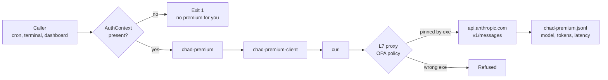

# Premium escalation

Chad's primary inference is `nvidia/nemotron-3-super-120b-a12b` on the
NVIDIA Endpoints free tier. It's fast, cheap, and reasoning-safe. It is
not, however, deep enough for every task — multi-turn coding, long
architecture sketches, careful PR review can outrun what an embedded
12B-active reasoning model produces.

For those, Chad escalates to Anthropic Claude (Sonnet by default, Opus
on demand) through a tightly gated wrapper. "Tightly gated" is the
interesting part — premium routes cost real money, so the policy
boundary is more aggressive than the autonomy gate.

## The four components

| Component | Path | What it does |
|---|---|---|
| `chad-premium` | `scripts/chad-cron-wrappers/chad-premium` | User-facing wrapper. Auto-detects `NEMOCLAW_INVOKER_TOKEN` for terminal use; reads `$CHAD_AUTH_CONTEXT_PATH` for cron use. |
| `chad-premium-client` | `scripts/chad-cron-wrappers/chad-premium-client` | Python helper that POSTs to `api.anthropic.com/v1/messages`. Shells the actual HTTP out to `curl` so OPA can pin a real binary identity. |
| `chad-auth-context` | `scripts/chad-cron-wrappers/chad-auth-context` | AuthContext drop and show. Each context is `{source, verifiedIdentity, allowsPremium, createdAt, scope}`. |
| `chad-premium.yaml` | `nemoclaw-blueprint/policies/presets/chad-premium.yaml` | L7 policy preset. Only `chad-premium-client` and `curl` may POST to `/v1/messages`. |

## Why a Python helper that shells out to curl

The L7 policy keys on `/proc/self/exe` — the literal binary identity of
the calling process. If `chad-premium-client` made the HTTP request
directly through Python's `urllib`, the policy would have to allow
`/usr/bin/python3` to reach Anthropic. That's far too broad — *any*
Python script in the sandbox would inherit network access to
`api.anthropic.com`.

By shelling the actual `POST` out to `curl`, the policy can pin both
binaries: `chad-premium-client` is allowed to *invoke* curl in this
context, and curl is allowed to reach `/v1/messages`. A compromised
Python script that fabricates an AuthContext still can't reach
Anthropic — its `/proc/self/exe` is `/usr/bin/python3`, which has no
allowlist entry for that endpoint.

## The AuthContext

Premium calls fail closed unless an AuthContext blob is on disk with
`allowsPremium: true`. Four code paths drop a valid context:

| Path | Trigger | How AuthContext is dropped |
|---|---|---|
| Dashboard `/premium <prompt>` | User types the prefix in the chat front-end | `chad-route-prompt` calls `chad-auth-context drop --source dashboard --identity operator-1` |
| Terminal `chad-premium` | Operator runs the binary directly | Wrapper auto-detects `NEMOCLAW_INVOKER_TOKEN` env, drops a context with `source: terminal` |
| `email-check` cron | `From:` matches an allowlisted operator address | Cron drops `source: email`, `identity: <sender>` |
| `issue-triage` cron | An open issue body or comment mentions an allowlisted operator handle | Cron drops `source: issue`, `identity: <mention>` |

Cron ticks with no inbound trigger have **no AuthContext**. The Python
helper checks for the file at startup; missing or stale context means
exit 1 before any network call.

## The full call path



The L7 hop is the load-bearing one. Even if `chad-premium-client` were
compromised and called `urllib` directly, the proxy would deny the
egress because Python isn't in the `chad-premium.yaml` allowlist.

## Logging

Every call appends to `/tmp/chad-premium.jsonl` — one JSON record per
line, with model, source, identity, in/out tokens, latency.
`chad-budget-audit` rolls these up weekly:

- model × source × identity × calls × tokens × p95 latency
- Sender breakdown (which inbound triggers cause the most spend)
- Outliers — single calls with high latency or high token cost

The roll-up is appended to `feedback-proposals.md` for human review.

## When Chad uses premium vs Nemotron

The gate is the `phase2:` block in `scripts/task-profiles.json`. Two
profiles are wired today:

- **`email-check`** — uses premium when the wrapper has parked replies
  worth thinking about and the sender is allowlisted.
- **`issue-triage`** — uses premium when an open issue mentions an
  allowlisted operator handle and is in the top-2 by score.

Other crons (workspace-backup, gbrain-dream, spawn-poll) do not
escalate. They're deterministic shell — there's nothing to think about.

## Daily cap

`auto-actions.json` includes `_budgets.spawn_premium`, today set to 8
calls/day. The action gate enforces the cap before the AuthContext
check:

```json
{
  "_budgets": { "spawn_premium": 8 },
  "spawn_premium": {
    "_default": "block",
    "operator-1": "auto",
    "agent":     "auto"
  }
}
```

When the counter is at 8, premium calls return `budget` (exit 3) and
fall through to draft mode — the work is parked, not refused.

## Drafts are still drafts

A premium-quality reply is *still* draft-only unless the action type
(`email_reply`, `issue_comment`, `pr_open`, etc.) is set to `auto`
under the recipient. Premium changes the *quality* of the reasoning;
the autonomy gate decides whether the result ships.

The two boundaries compose:

1. **Autonomy gate** — may Chad take this kind of action, against this
   target, today?
2. **Premium gate** — if the action is allowed, may Chad use Anthropic
   to reason about it?

A reply can be `auto` + `premium` (ship now, with deep thinking),
`auto` + `nemotron` (ship now, with embedded reasoning), `draft` +
`premium` (think hard, park for review), or `block` (refuse).
