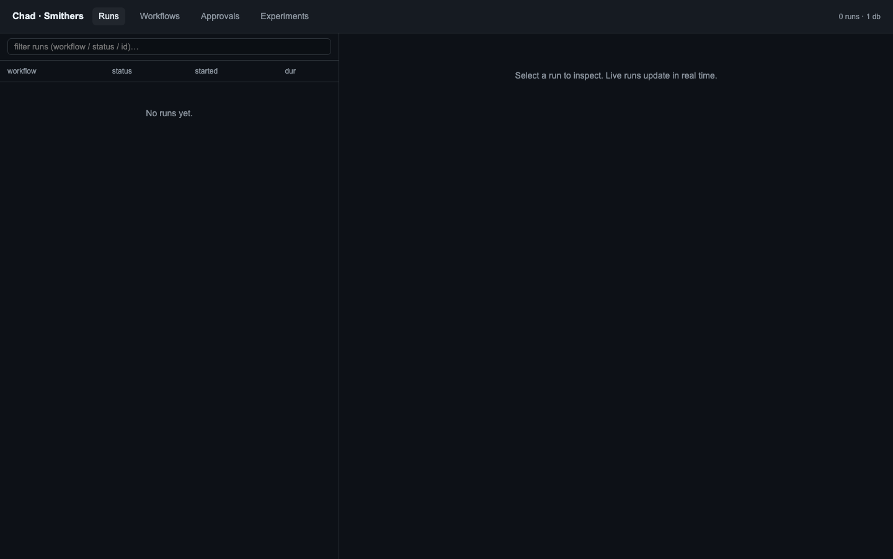
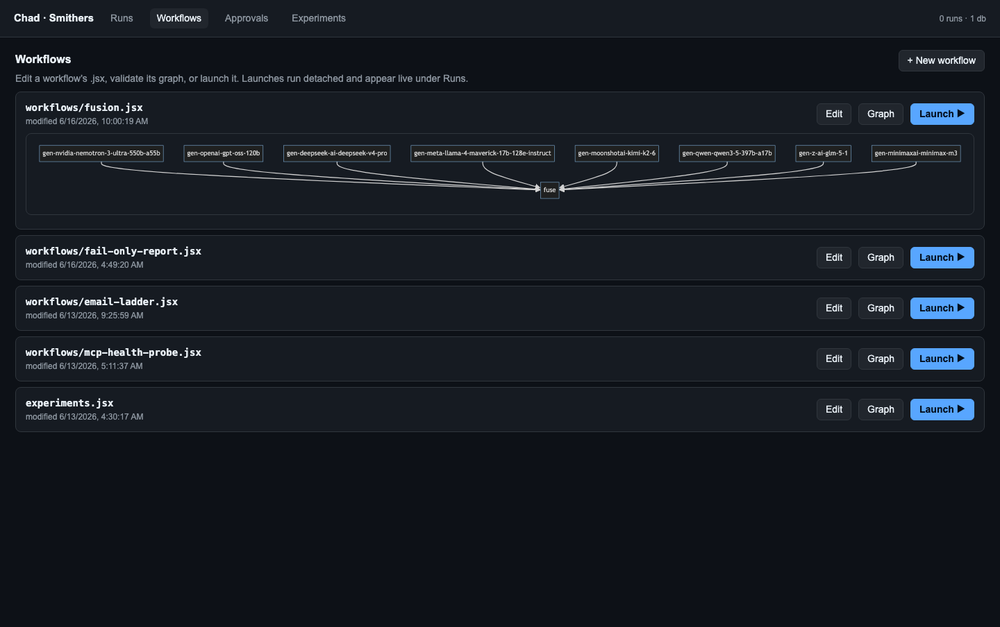
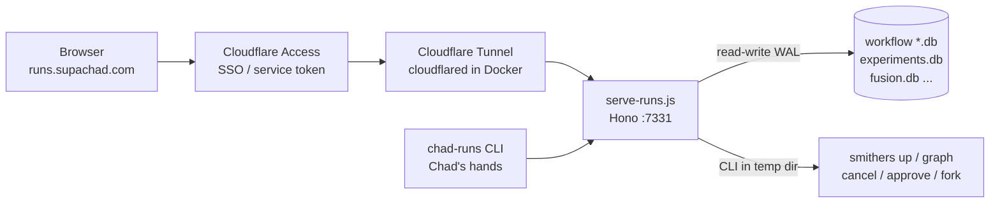

# Runs IDE: Smithers at runs.supachad.com

Chad's second front-end is a web IDE for **durable workflows**, served
at `runs.supachad.com`. Where Open WebUI is the *chat* surface,
the runs IDE is the *workflow* surface — it lets the operator watch,
inspect, edit, and launch [Smithers](https://smithers.sh) workflows
(experiments, fusion runs, the autonomy ladder) with full run history
and crash-resume.

It exists because the deterministic experiment cron could stall
mid-loop and leave **silence on every surface** — no artifact, no
ledger, nothing to debug. Smithers persists every frame to SQLite
regardless of whether the model cooperates, and this dashboard reads
those DBs directly. A stalled run is now *visible*, not invisible.

## What you see

The dashboard is four tabs over a dark, dependency-light UI (vanilla
JS + two CDN libs: CodeMirror for the editor, mermaid for the DAG).



| Tab | What it shows |
|---|---|
| **Runs** | Every run across every workflow DB, newest first. Live-polls (5 s for the list, 2.5 s while a run is active). Click a run for the task tree, per-node outputs, logs, chat, and diffs. |
| **Workflows** | The available `.jsx` workflow files, each rendered as an interactive DAG (from `smithers graph --format json`). |
| **Editor** | A CodeMirror view of the workflow source — read *and* edit the `.jsx`, save back to disk (path-validated server-side). |
| **Experiments** | The evolutionary-experiment leaderboard: variants scored, ranked, retired. |



From a run detail you can **cancel**, **approve / deny** an
`<Approval>` gate, **fork** a run for replay, **diff** any node's
output, and **launch** a new run of any workflow — all from the browser.

## How it's served

The summary: a durable Hono server reads the Smithers SQLite DBs
directly. There is no separate Smithers daemon to babysit — the DBs
*are* the source of truth, and the server auto-discovers new ones.



Key pieces, all under `scripts/chad-smithers/`:

| Path | Role |
|---|---|
| `serve-runs.js` | Hono server. Scans the workspace for `*.db` (skipping `smithers.db`), opens each **read-write** (WAL mode throws on readonly), exposes the REST API below. |
| `public/index.html` | The single-file dashboard. No build step. |
| `chad-runs` | An ESM Node CLI — Chad's programmatic hands on the same API (see below). |
| `workflows/*.jsx` | The workflow definitions (fusion, experiments, probes, the autonomy ladder). |
| `dev.nemoclaw.chad-runs-ui.plist` | launchd agent. Binds `0.0.0.0:7331`, `KeepAlive=true`. |

### Auth model

The server is fail-closed. Every request must present **either**:

- `x-smithers-key: <SMITHERS_RUNS_API_KEY>` (read from
  `credentials.json`) — how `chad-runs` and other programmatic callers
  authenticate; **or**
- `Cf-Access-Authenticated-User-Email` — the header cloudflared injects
  after Cloudflare Access SSO, how a human operator authenticates.

Anonymous requests (neither present) get `401`. Write endpoints
(launch / cancel / approve / fork / save-file) additionally pass
through an `operator(c)` gate.

### The CLI-vs-DB quirk

Smithers' CLI finds its DB by walking up for a file literally named
`smithers.db`. Chad's workflows use *named* DBs (`fusion.db`,
`experiments.db`, …) so several can coexist in one workspace. The
server bridges this with `cliWithDb(dbPath, args)`: it execs the CLI
in a temp dir holding a `smithers.db` symlink to the target DB. It
also captures output instead of throwing on non-zero exit, because
`smithers cancel` exits code 2 *on success*.

## The REST API

`serve-runs.js` endpoints (all under `/api`):

| Method + path | Purpose |
|---|---|
| `GET /health` | Liveness + DB count. |
| `GET /runs` | All runs across all DBs, newest first. |
| `GET /runs/:id` | One run: task tree + per-node outputs + status. |
| `GET /runs/:id/logs` | Run logs. |
| `GET /runs/:id/chat` | Run chat transcript (`smithers chat`). |
| `GET /runs/:id/diff/:node` | A node's output diff. |
| `GET /runs/:id/trace/:node` | Token / time / failure attribution for a node. |
| `GET /experiments` | The experiment leaderboard. |
| `GET /workflows` | Available workflow files. |
| `GET /workflow-graph` | `{dag, tree}` from `smithers graph --format json`. |
| `GET/POST /workflow-file` | Read / write a workflow's `.jsx` source (path-validated). |
| `POST /launch` | Start a new run of a workflow. |
| `POST /runs/:id/cancel\|approve\|deny\|fork` | Run lifecycle actions. |

## chad-runs — the agent's hands

Chad doesn't click a browser. `scripts/chad-smithers/chad-runs` is an
ESM CLI that talks to the same API so Chad can drive runs from a cron
turn or a chat reply. It reads `SMITHERS_RUNS_API_KEY` and the
`CF_ACCESS_CLIENT_ID/SECRET` service-token pair from `credentials.json`,
and targets `CHAD_RUNS_URL` (default `127.0.0.1:7331`).

```bash
chad-runs health
chad-runs runs                       # list
chad-runs get <id>                   # run detail
chad-runs logs <id>
chad-runs trace <id> <node>
chad-runs chat <id>
chad-runs diff <id> <node>
chad-runs workflows
chad-runs graph <workflow>
chad-runs cat <workflow>             # print .jsx
chad-runs save <workflow> <file>     # write .jsx
chad-runs launch <workflow> [--prompt ...]
chad-runs cancel <id>
chad-runs fork <id>
chad-runs approve <id> / deny <id>   # autonomy gates
chad-runs approvals                  # pending Approval nodes
chad-runs experiments                # leaderboard
```

The `openwebui` skill has a sibling **Smithers/runs** skill
(`scripts/chad-smithers/SKILL.md`) documenting these verbs with
worked examples.

## Workflow catalog

Every `.jsx` under the workspace is auto-discovered (it shows in the
Workflows tab and `chad-runs workflows`). Side-effecting workflows are
**shadow-safe by default** — they log what they would do until an
explicit env flag flips them to real mode, the same draft-only contract
as Chad's shell cron wrappers.

Side-effecting workflows run in shadow by default and take an explicit
env flag to enable irreversible actions (send, apply, publish) — the
same fail-safe default as Chad's cron wrappers and the `chad-action-gate`.
The "enable side-effects" column is the flag, not a missing feature.

| Workflow | What it does | Enable side-effects |
|---|---|---|
| `experiments.jsx` | Evolutionary drafter-prompt arena (start wide → score → keep) | runs nightly |
| `fusion.jsx` | One prompt across N models in parallel → fuse best | `--input '{"prompt":"…"}'` |
| `mcp-health-probe.jsx` | Probe gbrain / webui MCP surfaces, escalate on failure | runs as-is |
| `fail-only-report.jsx` | Quiet on green; report only on failure | runs as-is |
| `email-ladder.jsx` | Autonomy ladder: triage → draft → moderate → `Approval` → send | `CHAD_EMAIL_SEND=1` + allowlist |
| `issue-triage.jsx` | Fetch issues → score+route → `Parallel` spawn fixes → report | `CHAD_SPAWN_SSH=<host>` |
| `content-pipeline.jsx` | research → draft → review (spawns) → `Approval` → publish | `CHAD_CONTENT_PUBLISH=1` |
| `self-improve.jsx` | Cron telemetry → propose tunings → gate → apply | `CHAD_SELFIMPROVE_APPLY=1` |
| `memory-curator.jsx` | Inactivity-gate → snapshot → propose consolidations → `Approval` | `CHAD_CURATOR_APPLY=1` |
| `log-digest.jsx` | Cluster host service-log errors → note (quiet if clean) | `CHAD_LOGDIGEST_POST=1` |

The last five are the **ported chad-spawn / cron features** (the keep-both
decision below). They run on the same dashboard, resume after a crash,
and route their spawns through the bridge — see
[Orchestrator](orchestrator.md) for the per-workflow mapping.

## Fusion — all the models, fused

`workflows/fusion.jsx` is the marquee workflow: run one prompt across
**N models in parallel**, then fuse the answers into a single best
result (the mixture-of-models pattern, with a model shootout as a
side effect).

- Each model is its own durable `<Task>` inside a `<Parallel>`, so a
  slow or failed model doesn't sink the run.
- The roster resolves in order: `CHAD_FUSION_MODELS` env → the
  daily-refreshed `state/models.json` `featured` list → a hardcoded
  fallback. This is how the runs IDE gets access to **every model
  Open WebUI does** — the same NVIDIA catalog, kept current
  automatically.
- A capable synthesizer (`pickAgent("judge")`) merges the candidates,
  picks `best_model`, and explains the choice.

### Daily model refresh

`refresh-models.js` (launchd `dev.nemoclaw.chad-models-refresh`, daily
04:45 local) fetches `integrate.api.nvidia.com/v1/models`, filters to
chat / agentic models (excluding embed / safety / guard classes), and
writes `state/models.json` with `featured` (priority-ordered
flagships), `chat`, `new`, and `removed` lists. When NVIDIA launches a
new open model, the fusion roster and experiments pick it up the next
morning with no manual edit. (GLM 5.1 is on the NVIDIA API today; 5.2
is not yet — the refresh adopts it automatically when it lands.)

## Two orchestrators, on purpose

The runs IDE drives **chad-Smithers**, which coexists with the older
**chad-spawn** sub-agent orchestrator. They are complementary, not a
migration:

| | chad-spawn | chad-Smithers |
|---|---|---|
| Shape | imperative one-shot sub-agents (kind manifests) | declarative durable workflows (`.jsx`) |
| State | branch-as-record on chad-state | SQLite + live dashboard + resume |
| Best for | isolated one-shot agents (writer / coder / reviewer), GHA offload | multi-step pipelines, experiments, the autonomy ladder, anything inspectable / resumable |
| Substrate | in-container **or** GHA | host (live) — **plus** GHA via the bridge |

The decision is **keep both, bridge them**: chad-spawn stays the
GHA-isolated one-shot substrate, and a Smithers workflow can *call*
`chad-spawn` to offload one heavy step (a build, a big parallel eval)
onto a GitHub Actions runner, reconciling its `result.json` as that
task's output. The bridge is `lib/spawn.js`'s `runSpawn()` — a durable
task helper that shells out to the existing `chad-spawn` rather than
rebuilding any GHA machinery. See [Orchestrator](orchestrator.md) for
the bridge code and the migrated-workflow mapping, and
[Substrates](substrates.md) for the offload path.

## Models and reasoning

Workflows route through `agents.js`, a model router that auto-detects
tiers and routes by role (`pickAgent(role)`), with `opts.model` for
any specific model. The default capable agent is **Nemotron 3 Ultra
550B** (`nvidia/nemotron-3-ultra-550b-a55b`) with reasoning on — the
tool-call harness bug that affected earlier models is absent in Ultra
(verified by a tool-call round-trip). Backends: nemotron / local /
claudecode / codex / anthropic / opencode (the `opencode/big-pickle`
free model, via Smithers' built-in OpenCode adapter).

## Deploying it

Host side is already wired: the launchd agent binds `0.0.0.0:7331` and
`cloudflared` (in Docker, with `host.docker.internal:host-gateway`)
fronts it. The one operator step is **dashboard-only** (token-managed
tunnels can't be edited from a config file):

1. In Cloudflare Zero Trust, add a public-hostname route
   `runs.supachad.com → http://host.docker.internal:7331`.
2. Add an Access application for that subdomain mirroring
   `chad.supachad.com`'s policy.

Exact values are in
`scripts/chad-smithers/cloudflared-runs.ingress.example.yaml`. Until
that route is live, the nightly leaderboard still reaches the operator
as an OpenWebUI **note**.

## Surfacing runs in Open WebUI

The two front-ends are bridged, not merged (Open WebUI has no slot for
embedding an external app):

- **Run-report note (live today):** a post-run task writes a "Night of
  `<date>`" note into Open WebUI — tasks run, verdicts, artifacts
  created, anything stalled. The execution record is operator-visible
  even on a failed night.
- **Run-state tool (later):** an Open WebUI Tool that queries live run
  state, so "what happened last night?" in chat answers from the
  Smithers DBs.

See [Front-ends](front-ends.md) for the chat surface.
