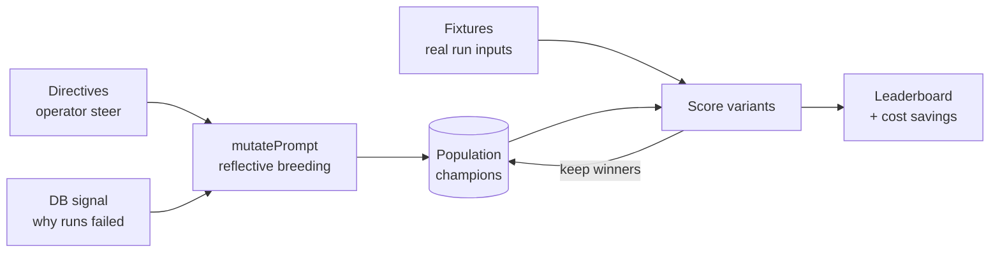
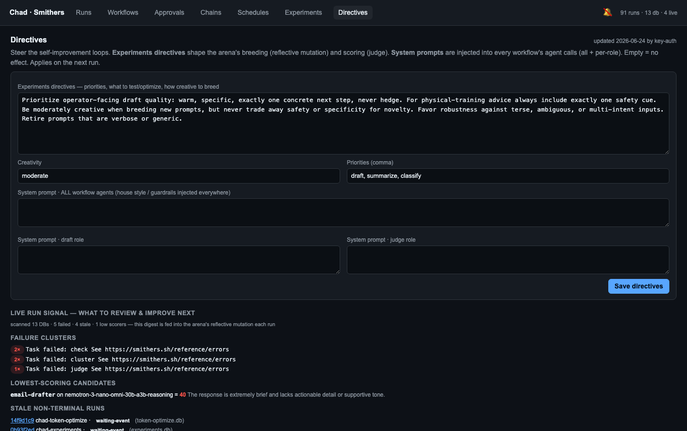
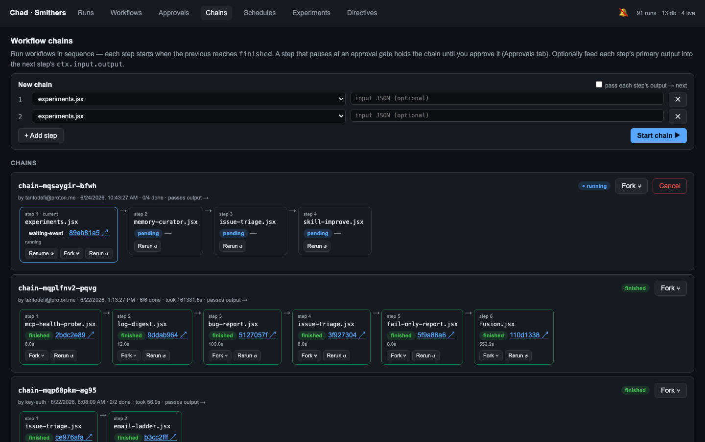

# Self-improvement: how Chad gets better on his own

Chad doesn't just run workflows — he runs workflows that **improve the workflows**.
Three loops, all `Approval`-gated and all visible in the [Runs IDE](runs-ide.md),
turn each night's runs into the next night's edge: an **evolutionary arena** that
breeds better prompts, a **cost loop** that proves when a cheaper model is good
enough, and a **maintenance loop** where Chad files his own bugs and enhancement
ideas. A fourth primitive — **workflow chaining** — lets these compose into
pipelines.

Everything here is **grounded in real run data**, not vibes: the loops read the
durable Smithers SQLite DBs (every frame of every past run) and the operator's
steering [directives](#directives-steering-the-loop) before proposing a change.

## The evolutionary arena (`experiments.jsx`)

The arena is a genetic loop over **drafter prompts**: start wide with a population
of prompt variants, score each against a fixture set, keep the winners, breed
mutants, retire the losers. It runs nightly and reports a leaderboard in the
Experiments tab.



- **Trace-grounded mutation.** Breeding isn't random. `lib/signal.js` scans every
  workflow DB for failed / stale / low-quality runs and extracts *why* they failed
  from the agent trace; `mutatePrompt()` reads that signal **plus** the operator
  directives, so a new variant targets a concrete failure mode (the same principle
  as Genetic-Pareto prompt evolution — mutations explain themselves).
- **Real fixtures.** `lib/fixtures.js` harvests evaluation inputs from actual past
  run inputs across the DBs (`harvestFixtures`), merged with a curated static set in
  `state/fixtures.json`. The arena scores against work Chad has really been asked to
  do, not synthetic toy prompts.
- **Champions persist.** Winning variants are stored and reused as the seed
  population — and as the auto-selected panel for [`fusion.jsx`](runs-ide.md#fusion-all-the-models-fused).

## Directives: steering the loop

`state/directives.json` is the operator's steering wheel. It's **tracked input**
with two effects:

1. The free-text `experiments` directive steers the arena's breeding and scoring
   (reflective mutation — "favor terse, cite-grounded drafts").
2. `agents.js#directiveSystem(role)` injects the relevant directive into **every
   agent's system prompt**, so a steer lands across all workflows, not just the
   arena.



Edit it in the **Directives** tab of the dashboard, or programmatically:

```bash
chad-runs directives > /tmp/d.json     # read current
#   …edit /tmp/d.json…
chad-runs set-directives /tmp/d.json   # lands in the next run + all agent prompts
chad-runs signal --days 7              # see what's feeding the next generation
```

The Directives tab also renders the live **DB-signal digest** and the **arena
fixtures**, so an operator can see exactly what the loop is reacting to.

## The cost loop: tokenmaxxing (`token-optimize.jsx`)

Every capable-tier call costs tokens; many tasks don't need the capable tier.
`token-optimize.jsx` probes — for each task kind — whether a **cheaper model
matches the quality bar**, and if so proposes an `Approval`-gated downgrade that
(on approval + `CHAD_TOKENOPT_APPLY=1`) is written into `task-profiles.json`
(snapshot-first, by dot-path). It runs nightly in shadow and feeds two dashboard
views:

- **`chad-runs model-matrix`** — the best model per task kind (the performance grid).
- **`chad-runs efficiency`** — tokens by workflow + the downgrade savings, realized
  and proposed. The Experiments tab surfaces the cumulative savings as a hero metric.

## The maintenance loop: Chad fixes Chad

Two nightly workflows close the loop on Chad's own reliability — both shadow by
default, both `Approval`-gated, neither ever edits source directly:

- **`bug-report.jsx`** — scans failed runs/nodes across the DBs **and** host service
  logs, clusters them into distinct bugs, and (on approval + `CHAD_BUGREPORT_POST=1`)
  files deduplicated GitHub issues.
- **`skill-improve.jsx`** — proposes enhancements to Chad's own workflows and skills
  (robustness / perf / cost / feature / docs) and files them as GitHub enhancement
  issues.

## Workflow chaining

Chaining strings several workflows into a sequential pipeline: each step launches
only after the prior reaches a terminal `finished` state, optionally feeding the
prior step's primary output forward as the next step's input (`passOutput`). A step
that pauses at an `<Approval>` gate **holds** the chain until the operator approves
— so chains compose cleanly with the autonomy ladder. Chains persist to
`state/chains/<id>.json`, so an in-flight chain survives a server restart and renders
in the **Chains** tab.



```bash
cat > /tmp/chain.json <<'JSON'
{ "passOutput": true, "steps": [
  { "workflow": "issue-triage.jsx" },
  { "workflow": "content-pipeline.jsx" } ] }
JSON
chad-runs chain-create /tmp/chain.json
chad-runs chains | jq '.chains[0] | {id, status, current}'
# a failed step: chad-runs chain-resume <id>  (or chain-rerun <id> --index 0)
```

## Safety: it's all gated

None of these loops act irreversibly on their own. Every side-effecting step is
**shadow-safe by default** (it logs what it would do) and takes an explicit env
flag to go live, then still passes through an `<Approval>` gate the operator
resolves in the dashboard or with `chad-runs approve`. The design bias is
deliberate: Chad proposes, the operator disposes — and because proposals are
issues and gated diffs rather than silent edits, every change is reviewable. See
[Autonomy & action gate](autonomy.md) for the trust model.

## How this compares — Smithers `burns`, Nous Hermes

Chad's loops were built against two reference points, and the comparison sets the
near-term roadmap:

- **Smithers `burns`** (the upstream "Smithers Manager") is the closest analogue to
  the [runs IDE](runs-ide.md): a Bun daemon + React UI + SQLite that supervises
  runs, edits workflows, and handles approval gates. Chad's dashboard matches it for
  single-workspace supervision and adds the self-improvement tabs (Directives,
  Experiments, Chains). What `burns` has that's on our list: **multi-repo/workspace
  aggregation**, **real-time event streaming** (the Smithers 0.24 gateway would give
  us this natively — see [Runs IDE](runs-ide.md#smithers-version-upgrade-path)), and
  **AI-assisted workflow authoring** in the editor.
- **Nous Hermes self-evolution** uses DSPy + **GEPA (Genetic-Pareto Prompt
  Evolution)** with **trace-grounded mutations** — read execution traces to learn
  *why* a run failed, then propose a targeted fix. Chad's arena is built on the same
  principle (`lib/signal.js` + directive-steered breeding + harvested fixtures), and
  selection is now **Pareto** (quality↑ vs cost↓): a leaner, slightly-weaker variant
  survives alongside the top scorer instead of being retired, so the arena keeps the
  whole trade-off frontier.

**What's next (deliberately gated).** Hermes closes its loop by opening **PRs**
behind constraint gates (test suite, size limits, semantic preservation, human
review); Chad stops at **filing issues** because he has no direct git-write to the
source repo by design ([Autonomy](autonomy.md)). The bridge is a constraint-gate
report — attach "tests pass / size ok / lint clean" evidence to each `skill-improve`
proposal — so a human PR is one review away without Chad ever auto-writing source.
The building blocks now exist: [`code-review-loop.jsx`](runs-ide.md#workflow-catalog)
(a produce→judge→refine `<Loop>` that converges on `approved`) is the review half, and Smithers'
own `fix-all-issues` workflow (0.24.2) is the upstream reference for the full
issue→implement→PR pipeline when it's time to wire it. Chain them:
`issue-triage → code-review-loop` already runs today as a [chain](#workflow-chaining).
