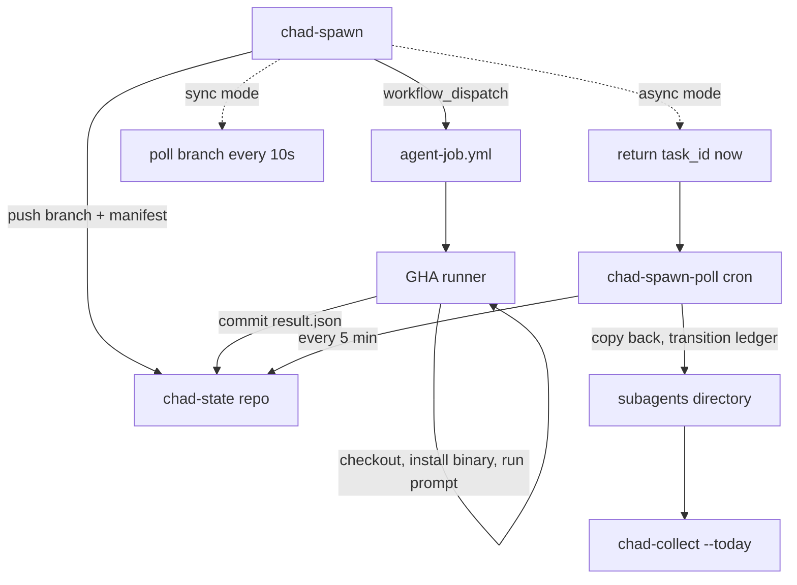

# Substrates: local vs GHA

Sub-agent spawns route to one of two execution backends. The choice
is set per-kind in the manifest's `substrate` field, with a per-spawn
override via `chad-spawn --substrate <local|gha>`.

## At a glance

| Property | `local` | `gha` |
|---|---|---|
| Runs in | Chad's container | Fresh GitHub Actions runner |
| Isolation | Process-tree shared with parent | Per-spawn VM, no shared state |
| L7 network policy | Enforced (kind preset) | **Lost** — runner has wide egress |
| Inference reach | Local Nemotron + NVIDIA gateway | Public APIs only |
| gbrain access | Direct (CLI subprocess) | None (would need export/sync) |
| Async | No (sync only) | Yes (`--async`) |
| Cost | Operator's hardware | GHA minutes (free tier or paid) |
| Audit trail | `subagents/<id>/`, `queue/tasks.jsonl` | Branch + workflow run history |

The two are complementary. Pick based on what the sub-agent needs:

- **Use `local`** when the sub-agent depends on Chad's local state —
  brain queries, the `/sandbox/source` clone, embedded Nemotron
  inference, or anything that needs to be inside the L7 policy boundary.
- **Use `gha`** when the work is self-contained — a codex run that just
  needs OpenAI (or NVIDIA fallback) and a prompt, an opencode call
  against a public repo. The runner's wide egress is fine because
  the sub-agent doesn't carry sensitive state.

## How `gha` substrate works

Inspired by the popebot agent-job pattern: every spawn becomes a
**branch in `tantodefi/chad-state`** plus a workflow trigger.



The branch carries the task id in its name (e.g. `chad-spawn/abc123`).
Inside the branch, the spawn artifacts live at `spawns/<task-id>/`:

```text
spawns/[task-id]/
├── prompt.txt        # rendered prompt
├── task.{json|txt}   # original input
├── kind.yaml         # snapshot of the kind manifest
├── manifest.json     # synthesized for the runner to read
├── stdout.log        # ← runner writes
├── stderr.log        # ← runner writes
└── result.json       # ← runner writes (the structured result)
```

The branch *is* the job record. There's no jobs table, no queue
service. `git log chad-spawn/<task_id>` is the audit trail. Even if
Chad's local subagents directory is wiped, the result is durable on
chad-state.

## Provider routing in the runner

The `agent-job.yml` workflow picks the inference provider at run time
based on which secret is set. This means a single
`NVIDIA_API_KEY` is enough to run codex/opencode kinds — no OpenAI
account required.

| Binary | Primary | Fallback | Notes |
|---|---|---|---|
| `codex` | `OPENAI_API_KEY` | `NVIDIA_API_KEY` via OpenAI-compat | Runner sets `OPENAI_BASE_URL=https://integrate.api.nvidia.com/v1` and `OPENAI_DEFAULT_MODEL=nvidia/nemotron-3-super-120b-a12b` |
| `opencode` | `OPENAI_API_KEY` | `NVIDIA_API_KEY` (same path) | Same env override pattern |
| `claude` | `ANTHROPIC_API_KEY` | none | Anthropic-only; `::error::` if missing |
| (unknown) | best-effort | NVIDIA preferred | Generic OpenAI-compat path tried |

The resolved provider is recorded in `result.json` so chad-collect
knows which backend produced each output.

!!! note "codex's responses API"
    Modern codex uses OpenAI's responses API endpoint. NVIDIA's
    OpenAI-compat endpoint may not fully implement that. If you hit
    a binary-side error with the NVIDIA fallback, the fix is to set
    `OPENAI_API_KEY` — no other change needed.

## Async mode + the reconciler

`chad-spawn --async --substrate gha` returns the task_id
immediately and writes a `running` ledger entry. The
`chad-spawn-poll` cron (every 5 min) does the reconciliation:

1. Scans the ledger for entries with `status: running` and
   `substrate: gha`.
2. For each, fetches the corresponding spawn branch.
3. If `result.json` exists: copies back to local
   `subagents/<id>/`, transitions the ledger entry to `done|failed`.
4. If timed out (older than `kind_timeout + 600s` by default):
   synthesizes a `failed` result with `exit_code: 124` and a
   "did not commit within Ns" summary.
5. Calls `chad-collect --today` if anything reconciled, so results
   flow into today's memory automatically.

## Branch retention

`chad-spawn-gc` (weekly Mon 02:30 UTC) deletes terminal-ized spawn
branches per retention policy:

- **done** branches: 7 days (recent successes audit-trail)
- **failed** branches: 30 days (longer for postmortem)
- **queued / running** branches: always kept (in flight)
- **unknown** (branch with no matching ledger entry): kept, flagged
  for operator review (state drift)

Without GC, the 24-spawn/day budget would accrue ~700 branches/month
on chad-state.

## Setting it up

The `gha` substrate needs one-time bootstrap on the operator host:

```bash
cd ~/.nemoclaw/source
./scripts/chad-state-bootstrap          # PR-based install (recommended)
# OR
./scripts/chad-state-bootstrap --no-pr  # commit straight to main
```

This clones chad-state, syncs `scripts/chad-state-templates/*` (the
`agent-job.yml` workflow), and opens a PR. After merge, set the
provider keys:

```bash
gh secret set NVIDIA_API_KEY     --repo tantodefi/chad-state --body "$KEY"
gh secret set OPENAI_API_KEY     --repo tantodefi/chad-state --body "$KEY"  # optional
gh secret set ANTHROPIC_API_KEY  --repo tantodefi/chad-state --body "$KEY"  # optional
```

Then verify Chad's sandbox-side `gh` has push access to chad-state:

```bash
ssh openshell-chad 'gh repo view tantodefi/chad-state'
```

And smoke-test:

```bash
ssh openshell-chad 'echo "Write a haiku about a sandbox" > /tmp/t.md && \
  chad-spawn --kind codex --task-file /tmp/t.md'
```

`codex` defaults to `substrate: gha`, so no `--substrate` flag needed.

## Smithers workflows reuse this substrate

The durable [Runs IDE](runs-ide.md) orchestrator (chad-Smithers) does
**not** build a parallel GHA system — it reuses the exact machinery
above. A Smithers workflow runs live on the host, but any single heavy
or isolated step can offload to a GitHub Actions runner via a
`<GhaTask>` helper that dispatches `chad-spawn-gha` and reconciles its
`result.json` as that task's output.

The trade-off is the same as for chad-spawn, with one extra
consideration: GHA runs are **batch**, not live-streamed. The
dashboard shows host orchestration live, but a GHA-offloaded task only
updates when its `result.json` reconciles back (runner spin-up +
`bun install` ≈ 1–2 min). So: **host for interactive / live, GHA for
heavy / parallel / isolated.** Needs `NVIDIA_API_KEY` as a chad-state
Actions secret (already set if you followed the bootstrap below).

There are two substrates: `local` and `gha`. A spawn picks one; that's
the whole choice.
